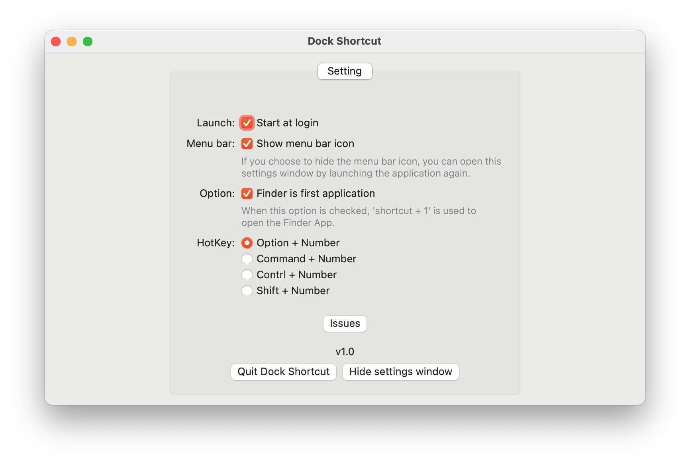

# Dock Shortcut

[简体中文](README_CHS.md)

Use the hotkeys to open the application in the dock. `option + 1` opens the 1st app in your dock, like Linux and Windows.

## Feature

- Free and open-source
- Support launch at login
- Consistent usage habits under Linux and Window

## Install

Download the latest version of the application from <https://github.com/yi-ge/dock-shortcut/releases>.

## Tips

- Use `option + number (1-9)` to open/hide the program corresponding to the Dock
- The shortcut to show and hide the Dock bar on MacOS is `option + command + d`
