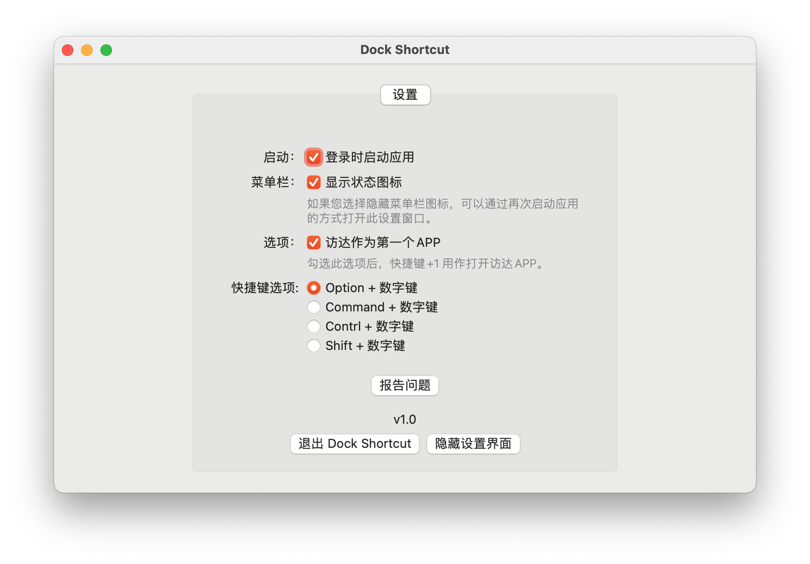

# Dock Shortcut

[ENGLISH](README.md)

使用热键来打开Dock中的应用程序。`option + 1` 打开Dock中的第一个应用程序，就像Linux和Windows那样。

## 特性

- 免费且开放源代码
- 支持在登录时启动
- 使用习惯在Linux和Window下保持一致

## 安装

从 <https://github.com/yi-ge/dock-shortcut/releases> 下载最新版的应用程序。

## 使用技巧

- 用 `option + 数字（1-9）` 打开/隐藏 Dock对应的程序
- MacOS系统显示和隐藏Dock栏的快捷键是 `option + command + d`
